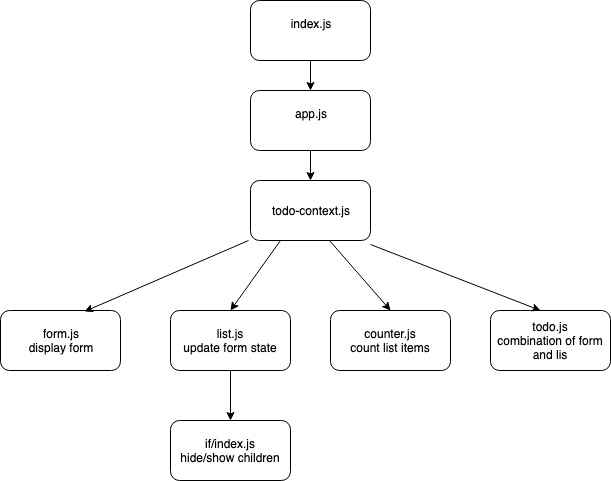

#  LAB

## lab-33-context-api

### Author: Bonnie Wang

### Links and Resources

- [submission PR](http://xyz.com)
- [travis](http://xyz.com)
- [back-end](http://xyz.com) (when applicable)
- [front-end](http://xyz.com) (when applicable)

#### Documentation

- [api docs](http://xyz.com) (API servers)
- [jsdoc](http://xyz.com) (Server assignments)
- [styleguide](http://xyz.com) (React assignments)

### Modules

#### `index.js`

#### `app.js`

### Components

#### `counter.js` -> counts number of list items

#### `form.js` -> displays form

#### `if.js` -> hides/displays children

#### `list.js` -> updates and changes form state

#### `todo.js` -> combination of form and list

#### Running the app

- `npm i`
- `npm start`
- Endpoint: `/foo/bar/`
  - Returns a JSON object with abc in it.
- Endpoint: `/bing/zing/`

  - Returns a JSON object with xyz in it.

#### Tests

- mounts successfully
- state changes

#### UML

